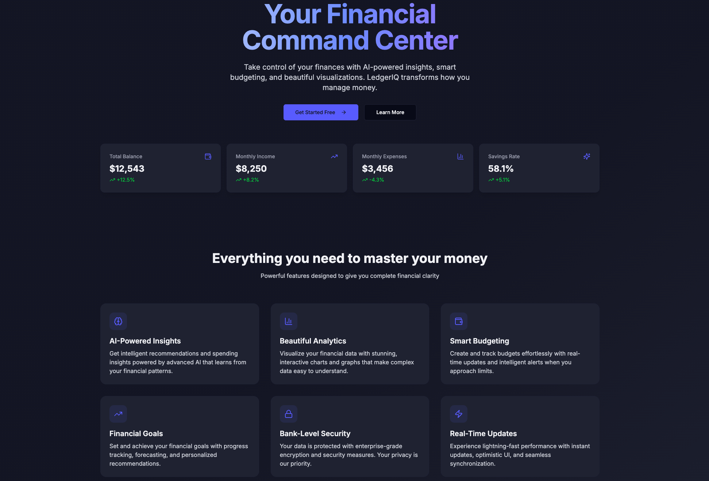
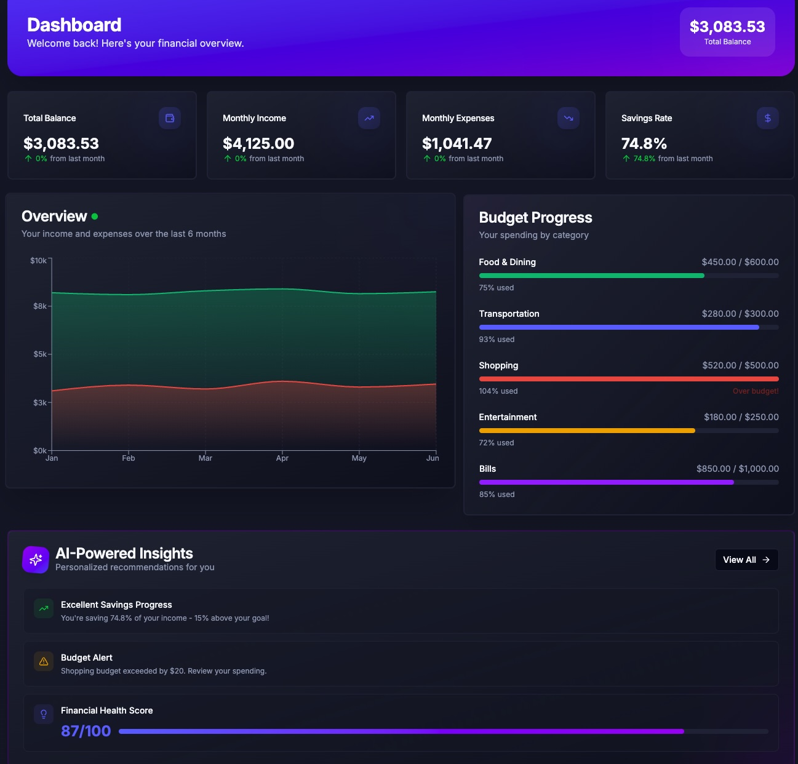
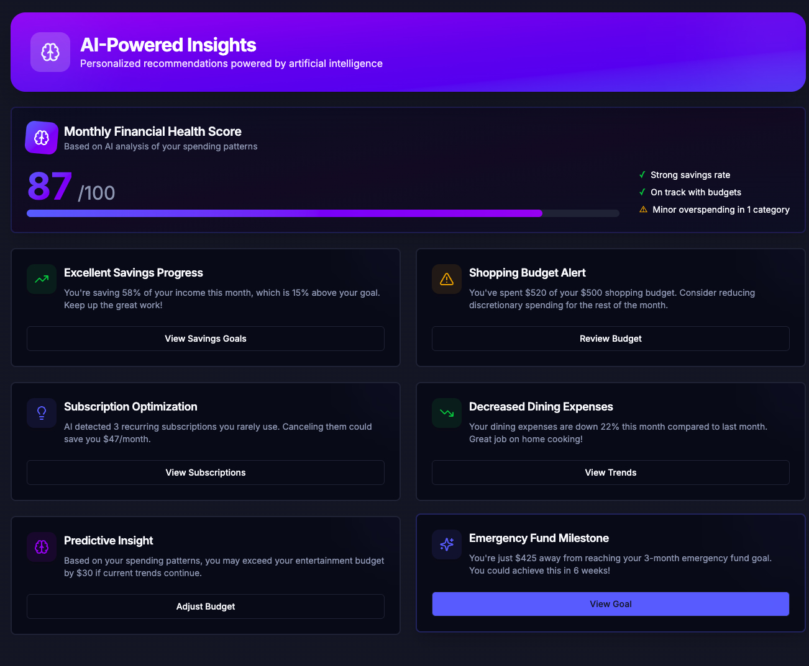

# LedgerIQ

> **Your AI-Powered Financial Command Center**

LedgerIQ is a modern, full-stack personal finance application that leverages AI to help users take control of their financial lives. Built with cutting-edge technologies and best practices, it offers beautiful visualizations, intelligent insights, and seamless user experience.

🎨 **[Live Demo](#)** | 📹 **[Video Walkthrough](#)** | 💼 **[Portfolio](https://yourportfolio.com)**

## 📸 Application Preview

<div align="center">
  
  <p><em>Modern landing page with gradient design</em></p>

  
  <p><em>Real-time dashboard with live statistics and transactions</em></p>

  
  <p><em>AI-powered financial insights and recommendations</em></p>
</div>

## ✨ Key Features Implemented

- ✅ **Real-time Dashboard** - Dynamic statistics calculated from actual transaction data
- ✅ **Transaction Management** - Full CRUD operations with search and filtering
- ✅ **RESTful API** - Type-safe API routes built with Next.js 14 App Router
- ✅ **Database Integration** - PostgreSQL with Prisma ORM for type-safe queries
- ✅ **Modern UI/UX** - Stunning glassmorphism design with smooth Framer Motion animations
- ✅ **Responsive Design** - Mobile-first approach that works beautifully on all devices
- ✅ **Dark Mode** - Full theme support with system preference detection

## Features

### Core Functionality
- **Smart Transaction Management** - Create, categorize, and track all your financial transactions
- **AI-Powered Categorization** - Automatically categorize transactions using OpenAI
- **Beautiful Analytics** - Interactive charts and graphs powered by Recharts and D3.js
- **Budget Tracking** - Create budgets and monitor spending in real-time
- **Financial Goals** - Set and track progress toward your financial goals
- **AI Insights** - Get personalized recommendations and spending analysis

### Technical Highlights
- **Real-time Updates** - Optimistic UI with React Query for instant feedback
- **Responsive Design** - Mobile-first design that works beautifully on all devices
- **Dark Mode** - Full theme support with system preference detection
- **Smooth Animations** - Polished transitions powered by Framer Motion
- **Type Safety** - End-to-end type safety with TypeScript and Prisma
- **Production Ready** - Built with scalability and performance in mind

## Tech Stack

### Frontend
- **Next.js 14** (App Router) - React framework with SSR and API routes
- **TypeScript** - Type-safe development
- **Tailwind CSS** - Utility-first styling
- **shadcn/ui** - High-quality React components
- **Framer Motion** - Smooth animations
- **Recharts** - Beautiful data visualizations
- **Zustand** - Lightweight state management
- **React Query** - Server state management

### Backend
- **Next.js API Routes** - Serverless functions
- **Prisma** - Type-safe ORM
- **PostgreSQL** - Robust database
- **OpenAI API** - AI-powered features

### Dev Tools
- **ESLint** - Code linting
- **Prettier** - Code formatting
- **Husky** - Git hooks

## 🚀 Quick Start

### Prerequisites
- Node.js 18+
- PostgreSQL database
- OpenAI API key (for AI categorization features)

### Installation

1. Clone the repository
```bash
git clone https://github.com/yourusername/ledgeriq.git
cd ledgeriq
```

2. Install dependencies
```bash
npm install
```

3. Set up environment variables
```bash
cp .env.example .env.local
```

Edit `.env.local` with your configuration:
```env
DATABASE_URL="postgresql://username@localhost:5432/ledgeriq"
OPENAI_API_KEY="your-api-key"
NEXT_PUBLIC_APP_URL="http://localhost:3000"
```

4. Set up the database
```bash
npx prisma generate
npx prisma db push
npm run db:seed  # Seeds demo data
```

5. Run the development server
```bash
npm run dev
```

Open [http://localhost:3000](http://localhost:3000) to see the application.

### Demo Credentials
The app comes pre-seeded with sample data. Just navigate to the dashboard to explore!

## 📸 Screenshots

### Dashboard
Beautiful overview with real-time statistics and animated charts.

### Transactions
Full transaction management with search, filter, and delete capabilities.

### Responsive Design
Works seamlessly across desktop, tablet, and mobile devices.

## Project Structure

```
ledgeriq/
├── app/                    # Next.js app directory
│   ├── api/               # API routes
│   ├── dashboard/         # Dashboard pages
│   ├── globals.css        # Global styles
│   ├── layout.tsx         # Root layout
│   ├── page.tsx           # Landing page
│   └── providers.tsx      # App providers
├── components/            # React components
│   ├── dashboard/         # Dashboard-specific components
│   ├── ui/                # Reusable UI components
│   └── theme-provider.tsx
├── lib/                   # Utility functions and services
│   ├── actions/           # Server actions
│   ├── hooks/             # Custom React hooks
│   ├── services/          # Business logic
│   └── utils/             # Helper functions
├── prisma/                # Database schema
│   └── schema.prisma
└── public/                # Static assets
```

## Database Schema

The application uses a well-structured PostgreSQL database with the following main entities:

- **Users** - User accounts and authentication
- **Accounts** - Financial accounts (checking, savings, credit, etc.)
- **Transactions** - All financial transactions
- **Categories** - Transaction categories
- **Budgets** - Budget tracking
- **Goals** - Financial goals
- **UserPreferences** - User settings and preferences

## Key Features Implementation

### AI-Powered Transaction Categorization
Transactions are automatically categorized using OpenAI's GPT-4 API, which analyzes the description and suggests the most appropriate category with a confidence score.

### Real-time Budget Tracking
Budgets are tracked in real-time with visual progress indicators. Users receive alerts when approaching budget limits (configurable threshold).

### Advanced Analytics
Interactive charts show spending trends, income vs. expenses, category breakdowns, and predictive forecasts using historical data.

### Optimistic UI
All mutations use optimistic updates for instant feedback, with automatic rollback on errors.

## Performance Optimizations

- **Code Splitting** - Automatic code splitting with Next.js
- **Lazy Loading** - Components and images load on demand
- **Memoization** - React.memo and useMemo for expensive computations
- **Server Components** - Leverage React Server Components for better performance
- **Image Optimization** - Next.js Image component for optimized images

## Security

- **SQL Injection Protection** - Prisma ORM prevents SQL injection
- **XSS Protection** - React's built-in XSS protection
- **CSRF Protection** - Built-in with Next.js
- **Environment Variables** - Sensitive data stored in environment variables
- **Authentication** - Secure authentication with Supabase (or your auth provider)

## Deployment

### Vercel (Recommended)
1. Push your code to GitHub
2. Import project in Vercel
3. Add environment variables
4. Deploy

### Docker
```bash
docker build -t ledgeriq .
docker run -p 3000:3000 ledgeriq
```

## Contributing

Contributions are welcome! Please feel free to submit a Pull Request.

## License

MIT

## 🎯 What Makes This Special

### Full-Stack Implementation
- **Backend**: RESTful API with Next.js App Router, Prisma ORM, and PostgreSQL
- **Frontend**: React Server Components, optimistic UI updates, and real-time data
- **Type Safety**: End-to-end TypeScript with Zod validation

### Modern Architecture
- **Database Design**: Well-structured schema with proper relations and indexes
- **API Design**: RESTful endpoints with proper HTTP methods and status codes
- **Component Structure**: Reusable, composable UI components with shadcn/ui

### Visual Excellence
- **Glassmorphism**: Modern frosted-glass effects throughout the UI
- **Animations**: Smooth Framer Motion animations for enhanced UX
- **Responsive**: Mobile-first design that adapts beautifully to any screen size

## 🚧 Roadmap

Future enhancements planned:
- [ ] Authentication with NextAuth.js
- [ ] AI-powered transaction categorization
- [ ] Budget alerts and notifications
- [ ] Financial goals tracking
- [ ] Analytics and spending insights
- [ ] Export data (CSV, PDF)
- [ ] Recurring transaction automation

## 👨‍💻 Author

**Nick Wyrwas**
- Portfolio: [yourportfolio.com](#)
- LinkedIn: [linkedin.com/in/yourprofile](#)
- GitHub: [@yourusername](#)

## 📄 License

MIT

---

**LedgerIQ** - Transform how you manage money with AI-powered financial intelligence.

Built with Next.js 14, TypeScript, Prisma, PostgreSQL, and Tailwind CSS.
